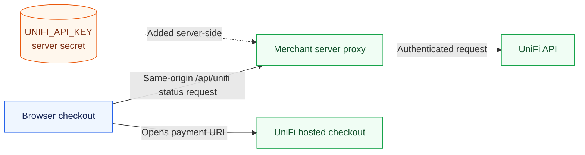

# UniFi Pay Widget

`unifi-pay-widget` is the primary TypeScript integration kit for adding UniFi stablecoin payments to a web checkout. It includes:

- framework-agnostic payment URL and session helpers;
- a typed payment-status client;
- accessible React payment, asset/network picker, status-sheet, and receipt components;
- a server-only proxy that keeps the UniFi API key out of browser bundles;
- examples for Cloudflare Pages and other Fetch API-compatible runtimes.

The package ships as ESM with TypeScript declarations. React is optional unless the application imports `unifi-pay-widget/react`.

See [FliQ Market](https://github.com/abhi3700/fliq-market) for a complete example application.

## Quick start

Install the current `main` branch directly from GitHub:

```sh
npm install 'github:abhi3700/unifi-pay-widget#main'
```

Import the component and its stylesheet once:

```tsx
import { UniFiPayWidget, UniFiReceiptLink } from "unifi-pay-widget/react";
import "unifi-pay-widget/styles.css";

export function Checkout({ merchantWalletAddress }: {
  merchantWalletAddress: string;
}) {
  return (
    <UniFiPayWidget
      amount="32.46"
      recipient={merchantWalletAddress}
      onPaid={(receiptId) => {
        console.log("UniFi payment confirmed", receiptId);
      }}
      onError={(error) => console.error(error)}
    />
  );
}

export function Receipt({ receiptId }: { receiptId: string }) {
  return <UniFiReceiptLink receiptId={receiptId} />;
}
```

By default, status requests go through `/api/unifi/payment/merchant/session/:sessionId` and hosted checkout links use `https://payunifi.com`.

## Production requirements

Every production merchant integration must configure both values:

```makefile
UNIFI_API_KEY=
MERCHANT_WALLET_ADDRESS=
```

- `UNIFI_API_KEY` is a secret read only by the server proxy.
- `MERCHANT_WALLET_ADDRESS` is public merchant configuration that the application passes to the widget as `recipient`. The widget does not read application environment variables directly.

The library uses `https://api.payunifi.com` and `https://payunifi.com` by default. `UNIFI_API_BASE_URL` and application-level checkout URL overrides are for UniFi administrators, local development, staging, or self-hosted deployments; merchant production integrations should leave them unset.



> [!CAUTION]
> Never expose `UNIFI_API_KEY` through `VITE_*`, `NEXT_PUBLIC_*`, or another client-visible variable. Do not commit environment files containing real credentials.

<details>
<summary><strong>Merchant onboarding and configuration</strong></summary>

1. Sign up at <https://payunifi.com/app/auth/signup> using email or a Web3 wallet.
2. Generate an API key using the [UniFi API guide](https://github.com/abhi3700/unifi-dev-kit/blob/main/api-http/README.md).
3. Store `UNIFI_API_KEY` in the deployment's encrypted secret store.
4. Store `MERCHANT_WALLET_ADDRESS` as server/application configuration and return it to the browser through a non-secret runtime-config endpoint, or otherwise inject it as public configuration.
5. Pass that wallet address to `UniFiPayWidget` or `createUniFiPayment` as `recipient`.

Only the API key is consumed by `unifi-pay-widget/server`. `MERCHANT_WALLET_ADDRESS` is the recommended application-level contract because the receiving wallet must be explicit and centrally configured in production.

</details>

<details>
<summary><strong>GitHub installation, main-branch refresh, and lockfiles</strong></summary>

The package currently tracks `main`:

```sh
npm install --save 'github:abhi3700/unifi-pay-widget#main'
```

npm resolves the branch to a commit and records that SHA in `package-lock.json`. A normal build does not automatically fetch a newer `main`. Refresh it explicitly before integration testing:

```sh
npm install --save --force 'github:abhi3700/unifi-pay-widget#main'
```

Review and commit the resulting lockfile change. Production deployment should then install the tested commit rather than silently resolve another one:

```sh
npm ci
npm run build
```

For local package development beside this repository:

```sh
npm install ../unifi-pay-widget
```

Git dependencies run the package's `prepare` script so consumers receive compiled `dist/` output.

</details>

<details>
<summary><strong>Add the server proxy</strong></summary>

The browser checks payment status through a same-origin proxy. The proxy allowlists only the status route needed by the widget and adds the API key server-side.

### Cloudflare Pages

Create `functions/api/unifi/[[path]].ts`:

```ts
import { createCloudflarePagesFunction } from "unifi-pay-widget/server";

type Env = {
  UNIFI_API_KEY: string;
  UNIFI_API_BASE_URL?: string;
};

export const onRequest = createCloudflarePagesFunction<Env>();
```

Configure `UNIFI_API_KEY` as an encrypted Cloudflare Pages secret. Most merchants should omit `UNIFI_API_BASE_URL` and use the built-in production endpoint.

### Fetch API-compatible server route

```ts
import { handleUniFiProxyRequest } from "unifi-pay-widget/server";

export function GET(request: Request) {
  return handleUniFiProxyRequest(
    request,
    {
      UNIFI_API_KEY: process.env.UNIFI_API_KEY,
    },
    { apiPrefix: "/api/unifi" },
  );
}
```

If the frontend and proxy use different origins, explicitly set `allowedOrigins`. Same-origin requests need no CORS configuration. Set `proxyBaseUrl` only when the application deliberately mounts the proxy at a different prefix.

</details>

<details>
<summary><strong>Integrate into an existing checkout</strong></summary>

Use `UniFiPaymentOption` when the host application owns its Pay button and success state:

```tsx
import { useState } from "react";
import {
  UniFiPaymentOption,
  UniFiPaymentStatusSheet,
} from "unifi-pay-widget/react";
import {
  checkUniFiPaymentStatus,
  createUniFiPayment,
  type UniFiPaymentSelection,
} from "unifi-pay-widget";
import "unifi-pay-widget/styles.css";

const [selection, setSelection] = useState<UniFiPaymentSelection>({
  asset: "USDT",
  network: "Ethereum",
});

<UniFiPaymentOption value={selection} onChange={setSelection} />;

const payment = createUniFiPayment({
  ...selection,
  amount: "32.46",
  recipient: merchantWalletAddress,
});

window.open(payment.payUrl, "_blank", "noopener,noreferrer");

const status = await checkUniFiPaymentStatus(payment.sessionId);
```

`UniFiPaymentStatusSheet` displays the generated link and calls the host application's status handler. It manages its own loading state unless a `checking` prop is supplied.

</details>

<details>
<summary><strong>Headless TypeScript usage</strong></summary>

No React dependency is needed for the root entry point:

```ts
import {
  UniFiClient,
  createUniFiPayment,
  createUniFiReceiptUrl,
} from "unifi-pay-widget";

const payment = createUniFiPayment({
  asset: "USDC",
  network: "Polygon",
  amount: 25,
  recipient: merchantWalletAddress,
});

const client = new UniFiClient();
const result = await client.checkPaymentStatus(payment.sessionId);

if (result.state === "paid") {
  console.log(createUniFiReceiptUrl(result.receiptId));
}
```

</details>

<details>
<summary><strong>Payment lifecycle and durable merchant records</strong></summary>

1. The merchant provides amount, recipient, asset, and network.
2. `createUniFiPayment` generates a cryptographically random 64-character hexadecimal session ID and hosted checkout URL.
3. The browser opens the UniFi checkout directly.
4. The merchant page checks `/api/unifi` with the session ID.
5. The proxy validates the request, adds the server-held API key, and requests the UniFi API.
6. An empty response remains pending; a non-empty value is the receipt ID.

UniFi stores the `session_id → receipt_id` status mapping in Redis for two hours. This temporary mapping supports checkout polling but is not a durable merchant order record. Persist the order, session ID, and confirmed receipt ID in the merchant database, and fulfill only after trusted server-side confirmation.

Blockchain inclusion and finality are separate from receiving a receipt ID. Apply the confirmation policy appropriate to the selected network before treating irreversible fulfillment as final.

</details>

<details>
<summary><strong>Supported pairs and API overview</strong></summary>

### Supported payment pairs

- Assets: USDT, USDC, DAI
- Networks: Ethereum, Polygon, Sepolia

The package does not silently change a user's selected pair. The hosted checkout remains the final authority on whether a pair is currently available.

### `UniFiPayWidget`

Required props are `amount` and `recipient`. Useful optional props include:

- `value`, `defaultValue`, and `onChange` for controlled or uncontrolled selection;
- `proxyBaseUrl` and `checkoutBaseUrl` for non-default deployments;
- `onSession`, `onStatus`, `onPaid`, and `onError` lifecycle callbacks;
- `expirySeconds`, `disabled`, `buttonLabel`, and `openInNewTab`.

### `UniFiPaymentOption`

A controlled payment-method row and bottom-sheet pair picker. Use `selected` and `onSelect` when it participates in a larger payment-method radio group.

### `UniFiPaymentStatusSheet`

A controlled bottom sheet. Supply `open`, `secondsLeft`, `statusText`, `payUrl`, `onCheckStatus`, and `onClose`.

### `UniFiReceiptLink`

Builds a canonical UniFi receipt URL from `receiptId` and renders an external link.

See the [API reference](docs/api-reference.md), [architecture](docs/architecture.md), and [merchant checklist](docs/integration-checklist.md) for the complete contracts.

</details>

<details>
<summary><strong>Customize the theme</strong></summary>

Override CSS variables near the application root:

```css
.my-checkout {
  --unifi-primary: #321967;
  --unifi-primary-hover: #281252;
  --unifi-accent: #6d28d9;
  --unifi-accent-soft: #f5f3ff;
}
```

Class names are prefixed with `unifi-widget` to minimize collisions. The UI follows the host application's font.

</details>

<details>
<summary><strong>Library development and future publishing</strong></summary>

```sh
npm install
npm run check
npm test
npm pack --dry-run
```

Node.js 20 or newer is required for development and tests.

When the npm package is ready, authenticate with npm and publish from a clean commit:

```sh
npm publish --access public
```

Consumers can then replace the GitHub dependency with a normal package dependency without changing imports.

</details>

## License

MIT
